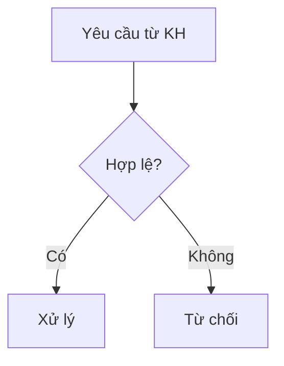

# 📘 Hướng Dẫn Tích Hợp Mermaid.js Cho Mọi Dự Án

Tài liệu hướng dẫn cách mang **Mermaid.js** vào bất kỳ dự án nào (Web App, Python API, Dashboard, Tài liệu Markdown, Tool xuất PDF tự động).

---

## 🚀 Cách 1: Nhúng vào Web App (FastAPI, Flask, Express, HTML thuần)
> **Mục tiêu:** Hiển thị sơ đồ động, có thể phóng to, thu nhỏ, kéo rê trên giao diện web.

### 1. Template HTML "Cắm là chạy" (Plug & Play)
Chỉ cần copy khung HTML sau vào thư mục `templates/` hoặc file `.html` của bất kỳ dự án nào:

```html
<!DOCTYPE html>
<html lang="vi">
<head>
    <meta charset="UTF-8">
    <title>Sơ Đồ Quy Trình</title>
    <!-- 1. Thư viện Mermaid & Zoom Pan từ CDN -->
    <script src="https://cdn.jsdelivr.net/npm/mermaid@10/dist/mermaid.min.js"></script>
    <script src="https://cdn.jsdelivr.net/npm/svg-pan-zoom@3.6.1/dist/svg-pan-zoom.min.js"></script>
    <style>
        body { margin: 0; font-family: sans-serif; background: #0f172a; color: #fff; }
        .toolbar { padding: 10px 20px; background: #1e293b; border-bottom: 1px solid #334155; display: flex; gap: 10px; }
        .btn { background: #0284c7; color: #fff; border: none; padding: 6px 14px; border-radius: 6px; cursor: pointer; }
        #canvas-container { width: 100vw; height: calc(100vh - 55px); overflow: hidden; }
        .mermaid { width: 100%; height: 100%; }
        .mermaid svg { width: 100% !important; height: 100% !important; }
    </style>
</head>
<body>
    <div class="toolbar">
        <button class="btn" onclick="panZoom.zoomIn()">➕ Phóng to</button>
        <button class="btn" onclick="panZoom.zoomOut()">➖ Thu nhỏ</button>
        <button class="btn" onclick="panZoom.resetZoom(); panZoom.center();">🎯 Đặt lại</button>
        <button class="btn" style="background:#10b981;" onclick="window.print()">🖨️ In / PDF</button>
    </div>

    <div id="canvas-container">
        <!-- 2. Đặt nội dung sơ đồ vào thẻ có class="mermaid" -->
        <div class="mermaid" id="my-flowchart">
flowchart TD
    START(["🚦 Bắt đầu"]) --> STEP1{"Kiểm tra điều kiện?"}
    STEP1 -- "Đúng" --> OK["✅ Xử lý thành công"]
    STEP1 -- "Sai" --> FAIL["❌ Báo lỗi / Chuyển KTV"]
        </div>
    </div>

    <!-- 3. Khởi tạo Mermaid và gắn tính năng kéo/zoom chuột -->
    <script>
        mermaid.initialize({ startOnLoad: true, theme: 'dark' });
        let panZoom;
        window.addEventListener('load', () => {
            setTimeout(() => {
                const svg = document.querySelector('#my-flowchart svg');
                if (svg) {
                    panZoom = svgPanZoom(svg, { zoomEnabled: true, controlIconsEnabled: false, fit: true, center: true });
                }
            }, 500);
        });
    </script>
</body>
</html>
```

### 2. Định tuyến trên Python (FastAPI / Flask)
- **FastAPI:**
  ```python
  @app.get("/flowchart", response_class=HTMLResponse)
  def view_flowchart():
      with open("templates/flowchart.html", "r", encoding="utf-8") as f:
          return HTMLResponse(content=f.read())
  ```
- **Flask:**
  ```python
  @app.route("/flowchart")
  def view_flowchart():
      return render_template("flowchart.html")
  ```

---

## 🐍 Cách 2: Sinh sơ đồ động từ Code Python (Backend)
> **Mục tiêu:** Python tự truy vấn DB, đọc dữ liệu và sinh ra chuỗi Mermaid để vẽ sơ đồ trạng thái realtime của đơn hàng / ticket / cuộc gọi.

```python
def generate_ticket_flow_mermaid(ticket_data):
    """Tự động sinh mã Mermaid từ dữ liệu đơn/phiếu"""
    lines = ["flowchart TD"]
    lines.append(f'    START(["Phiếu {ticket_data["code"]}"]) --> STEP1["Tiếp nhận"]')
    
    if ticket_data["status"] == "CLOSED":
        lines.append('    STEP1 --> STEP2["Đã hoàn thành"]:::done')
    else:
        lines.append('    STEP1 --> STEP2["Đang xử lý"]:::doing')
        
    lines.append('    classDef done fill:#dcfce7,stroke:#22c55e,color:#15803d;')
    lines.append('    classDef doing fill:#fef9c3,stroke:#eab308,color:#854d0e;')
    return "\n".join(lines)
```

---

## 📄 Cách 3: Xuất tự động ra file PDF / PNG / SVG bằng CLI
> **Mục tiêu:** Dùng trong script tự động xuất báo cáo gửi email, nộp sếp, không cần mở trình duyệt.

Sử dụng tool chính thức **`@mermaid-js/mermaid-cli`** (không cần cài đặt global, gọi qua `npx` của Node.js):

### 1. Dòng lệnh trực tiếp (Terminal / PowerShell):
```powershell
# Tạo file text chứa sơ đồ
echo "flowchart TD; A[Bắt đầu] --> B[Kết thúc];" > sodo.mmd

# Xuất ra PDF
npx -y @mermaid-js/mermaid-cli -i sodo.mmd -o sodo.pdf

# Xuất ra ảnh PNG sắc nét (scale x2)
npx -y @mermaid-js/mermaid-cli -i sodo.mmd -o sodo.png -s 2

# Xuất ra ảnh vector SVG (siêu nhẹ, không vỡ hạt)
npx -y @mermaid-js/mermaid-cli -i sodo.mmd -o sodo.svg
```

### 2. Gọi tự động từ Python:
```python
import subprocess

def export_mermaid_to_pdf(mermaid_code_str, output_pdf_path):
    with open("temp.mmd", "w", encoding="utf-8") as f:
        f.write(mermaid_code_str)
    
    cmd = f'npx -y @mermaid-js/mermaid-cli -i temp.mmd -o "{output_pdf_path}"'
    subprocess.run(cmd, shell=True, check=True)
    print(f"Đã xuất PDF thành công: {output_pdf_path}")
```

---

## 📝 Cách 4: Nhúng vào File Báo Cáo Markdown (`.md`)
> **Mục tiêu:** Viết tài liệu dự án, README, Wiki, GitHub.

Chỉ cần mở khối mã với nhãn `mermaid`:

````markdown

````
GitHub, GitLab, Obsidian, Notion và các công cụ Markdown hiện đại sẽ tự động vẽ sơ đồ ngay lập tức mà không cần bất kỳ cài đặt nào!
